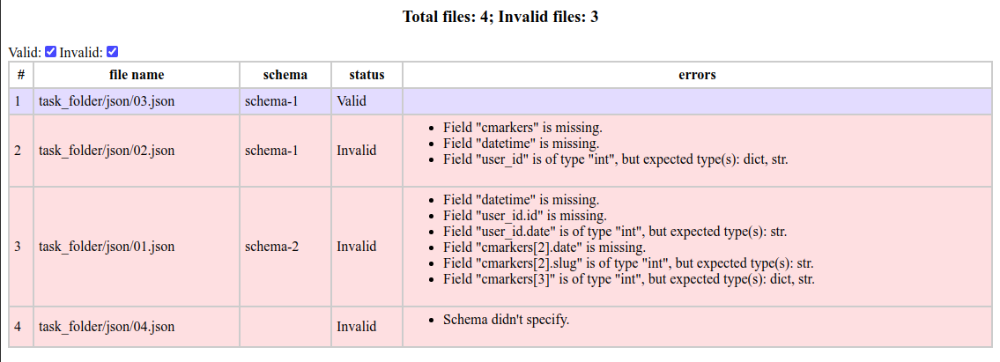

# JSON Validator
Validate a json instance(s) under a given schema(s).

## Usage

```bash
python3 json_validator.py target schema t_subdir s_subdir field_name
```

Where:
- target: directory or a JSON file. (required)
- schema: directory or a SCHEMA file. (required)
- t_subdir: include all target subdirectories.(default: false)
- s_subdir: include all schema subdirectories.(default: false)
- field_name: field name in a JSON file with schema file name.(default: None)

* if the schema is a directory you should specify `field_name`

The result of the check is saved in the file ``report.html``.

## Example

```bash
python3 json_validator.py 'task/json' 'task/schema' true false 'event'
```
### Report:

<p align="center">
  
</p>
